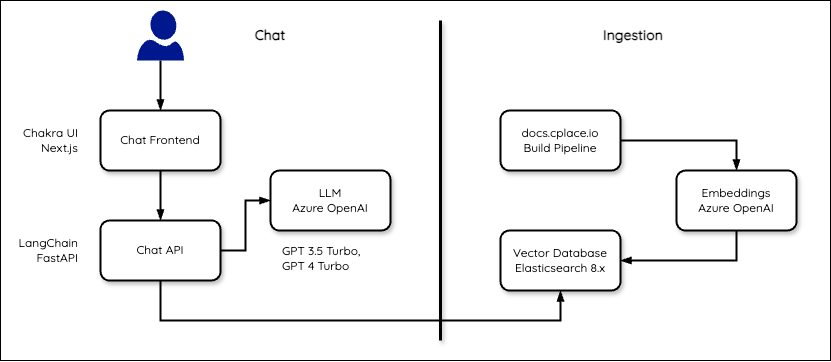

# cplace Docs Chat

This is a Gen-AI chat for the cplace documentation.
It is currently intended for demonstration purposes only - it is **not** intended to be used in production.

## Use-Case

The main use case of this chat is to provide a conversational interface to the cplace documentation.
It is not intended for forth and back conversation, but rather for querying the documentation.

Therefore, the LLM will be configured to respond concisely (up to 200 words) and include citations of the sources.

## Components

- Elasticsearch 8.x hosted on IDP Docker Swarm
- LangChain Chat API and Frontend hosted on IDP Docker Swarm
- An ingestion script that reads the cplace documentation and indexes it into Elasticsearch
- SQLite database as the record manager for the ingestion script
- Azure OpenAI for Embedding and Chat (LLM).
  Note: Azure OpenAI does not provide the latest models in the EU region - but using GPT 3.5 Turbo is sufficient for this use-case.

## Data Ingestion

The data ingestion script is a [Python script](./backend/ingest.py).
It reads the customer-facing cplace documentation and indexes it into Elasticsearch.

Data Sources:

1. cplace _public_ Documentation will be provided as a Markdown bundle file
   ([created](https://github.com/collaborationFactory/cplace-jenkins/blob/master/pipelines/build-rag-index.jdp) by IDP Jenkins).
   It contains markdown files from all relevant product repositories.
2. cplace _public_ PDF Documents, for example, Marketing material.

The following sources are currently not feasible for ingestion:

- cplace Release Notes on Productboard: https://roadmap.cplace.io/tabs/1-launched.
  The parsing requires JavaScript, so the simple parsers are not sufficient.
- Low-Code API: https://docs.cplace.io/lowcode/api/.
  The API documentation does currently not seem beneficial to be ingested.

The [LangChain indexing API](https://python.langchain.com/docs/modules/data_connection/indexing/) is used to keep documents in sync with the Elasticsearch index.

Specifically, it helps:

- Avoid writing duplicated content into the vector store
- Avoid re-writing unchanged content
- Avoid re-computing embeddings over unchanged content

A SQLite database is used as the record manager.
